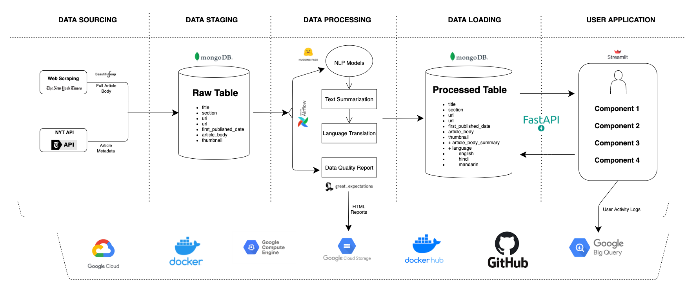

# News-Aggregator 🗞

## Abstract 📝
News websites and applications are gradually being replaced by user-centric news applications. One of the major reasons behind this change is that these apps provide a personalized experience to the users where they can get their desired content without having to go through the long list of articles.

## Links 📎
* Codelab Doc - [link](https://codelabs-preview.appspot.com/?file_id=1P-Xi5PIIHyq5mawC_BRJdVk84_XJbGEQhYMunsNA0p4#0)
* Airflow - [link](http://34.73.35.12:8080/)
* FastAPI Doc - [link](http://34.73.35.12:8090/docs)
* Streamlit - [link](http://34.73.35.12:8095/)
* Website - [link](http://news.anandpiyush.com/)

## Architecture 👷🏻‍♂️




---

## Source Code References 💻

1. Branch: **airflow** - [link](https://github.com/BigDataIA-Summer2022-Team04/News-Aggregator/tree/airflow)
   1. Web Scraping DAG
   2. Great Expectation Report DAG
   3. Data Processing Script
   4. Docker Compose Config
    ```text
    ├── DAG_generator.py
    ├── DAG_template.py
    ├── dags
    │   ├── NYT_Scraping_arts.py
    │   ├── NYT_Scraping_automobiles.py
    │   ├── NYT_Scraping_books.py
    │   ├── NYT_Scraping_business.py
    │   ├── NYT_Scraping_climate.py
    │   ├── NYT_Scraping_education.py
    │   ├── NYT_Scraping_fashion.py
    │   ├── NYT_Scraping_food.py
    │   ├── NYT_Scraping_health.py
    │   ├── NYT_Scraping_science.py
    │   ├── NYT_Scraping_sports.py
    │   ├── NYT_Scraping_technology.py
    │   ├── NYT_Scraping_travel.py
    │   ├── NYT_Scraping_universal.py
    │   ├── NYT_Scraping_world.py
    │   └── ge-report.py
    ├── data_processing.py
    └── docker-compose.yaml
    ```
2. Branch: **great-expectations** - [link](https://github.com/BigDataIA-Summer2022-Team04/News-Aggregator/tree/great-expectations)
   1. Great Expectation Checkpoint Source Code
    ```text
    └── great_expectations
        ├── checkpoints
        │   └── nyt_raw_data_suite_checkpoint_v1
        │       ├── 0.yml
        │       └── 1.yml
        ├── data
        ├── expectations
        │   └── nyt_raw_data_suite.json
        ├── great_expectations.yml
        ├── plugins
        │   └── custom_data_docs
        │       ├── renderers
        │       ├── styles
        │       │   └── data_docs_custom_styles.css
        │       └── views
        └── profilers
    ```


3. Branch: **fastapi** - [link](https://github.com/BigDataIA-Summer2022-Team04/News-Aggregator/tree/fastapi)
   1. Backend Data Service Endpoints
    ```text
    ├── Dockerfile
    ├── __init__.py
    ├── custom_functions.py
    ├── database.py
    ├── iam.db
    ├── keys
    ├── main.py
    ├── models.py
    ├── requirements.txt
    ├── routers
    │   ├── __init__.py
    │   ├── authentication.py
    │   ├── mongodb.py
    │   ├── news_feeds.py
    │   ├── oaut2.py
    │   ├── token.py
    │   ├── users.py
    │   └── whatsapp.py
    ├── schemas.py
    ├── test_cases
    │   ├── dev_server.html
    │   ├── prod_server.html
    │   └── test.py
    └── ui
        ├── assets
        ├── components.html
        └── index.html
    ```


4. Branch: **streamlit** - [link](https://github.com/BigDataIA-Summer2022-Team04/News-Aggregator/tree/streamlit)
   1. User Application Source Code
    ```text
    ├── Dockerfile
    ├── main.py
    └── requirements.txt
    ```

---

## Team Member 👩🏻‍💻 👨🏻‍💻
1. Jui Chavan - [Linkedin](https://www.linkedin.com/in/juichavan/) - [Email](chavan.ju@northeastern.edu)
2. Piyush Anand - [Linkedin](https://www.linkedin.com/in/anandpiyush/) - [Email](anand.pi@northeastern.edu)


## Individual Contribution ⚖️

| **Developer** 	|          **Deliverables**          	|
|:-------------:	|:----------------------------------:	|
|      Jui      	| Streamlit Component 1              	|
|      Jui      	| FastAPI Endpoint - Feeds           	|
|      Jui      	| Technical Documentation            	|
|      Jui      	| UI Testing                         	|
|     Piyush    	| Data Ingestion pipeline            	|
|     Piyush    	| Data Processing pipeline           	|
|     Piyush    	| Streamlit Component 2 and 3        	|
|     Piyush    	| FastAPI Endpoint - Database and IM 	|
|     Piyush    	| Technical Documentation            	|
|     Piyush    	| Infra Deployment                   	|

## Endnotes 👮🏻‍♂️

> WE ATTEST THAT WE HAVEN’T USED ANY OTHER STUDENTS’ WORK IN OUR ASSIGNMENT AND ABIDE BY THE POLICIES LISTED IN THE STUDENT HANDBOOK

**Contribution**: 🤝
*   Jui &ensp; &emsp;: `40%`
*   Piyush : `60%`

---